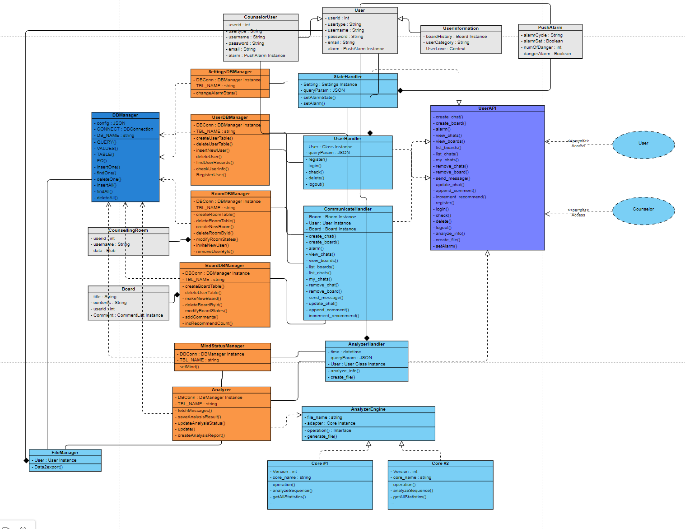

# EDICIUS & 미래산업혁명과 기술창업
# Administrator : 송경식, 임재혁
# Client

## React ver & Material-Ui ver

React V17.0.1
Material-ui V4.11.3

## Project Name & Pitch

그룹 카운셀링

React, Redux, JavaScript 및 styled-component로 구축된 사용자가 자신의 고민을 게시판 및 채팅창에 올리고 자신의 감정 분석을 확인할 수 있고, 상담이 필요할 시에 상담사와 상담이 가능합니다.

## Project Status

이 프로젝트는 현재 채팅창을 제외하고는 개발 완료 되었습니다.
채팅창의 경우에는 AWS사용으로 인한 리액트 소켓의 사용 불가로 인해 채팅창이 구현이 되지 못하였고,
이름 제외하고는 현재 Client 부분은 모두 개발이 완료된 상태입니다.

## Installation and Setup Instructions

이 저장소를 `git clone`을 통해 클론합니다. 이후 npm을 설치하고 터미널로 클라이언트 부분에 들어가 npm install을 통해 `node_modules` 를 설치합니다.

설치:

`npm install`

노드 모듈을 시작합니다

`npm start`

앱을 실행합니다.

localhost:3000

## Reflection

이 프로젝트는 소프트웨어 공학 수업에서 진행한 프로젝트였습니다.
프로젝트 목표에는 소프트웨어 공학 수업에서 배운 여러 문서에 관한 부분을 프로그래밍을 통해 구현하는 것 까지를 목표로 합니다.

# Server

## Installation and Setup Instructions on server

설치:

클론을 성공한 디렉토리에서 server 디렉토리 내부로 접속합니다.

디렉터리 내부에서 `npm install -g serverless` 를 통해 serverless 모듈을 설치합니다.

`serverless login`

디폴트 브라우저를 통해 서버리스에 대한 계정 인증을 수행합니다

`serverless`

아무런 인자를 제공하지 않고 serverless만을 실행하여 서버리스에 대한 configuration을 수행하고 deploy는 n을 선택합니다

`serverless plugin install -g serverless-dynamodb-local`

dynamodb를 설치하고 그 외의 외부 node 모듈들 또한 설치를 수행해줍니다, 필요한 노드 모듈은 실행할 때 누락 에러가 발생하기 때문에 메시지를 참고하면 알 수 있습니다.

`sls offline start`

offline으로 serverless를 실행하면 모의 테스트 환경용 백엔드 서버가 실행됩니다.

# UML Diagram
